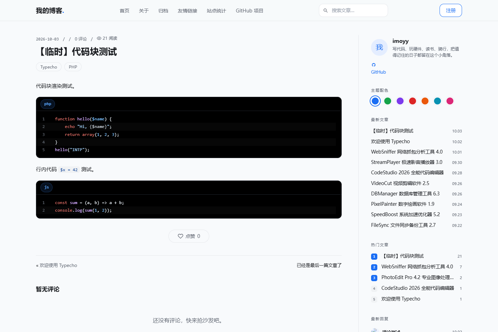
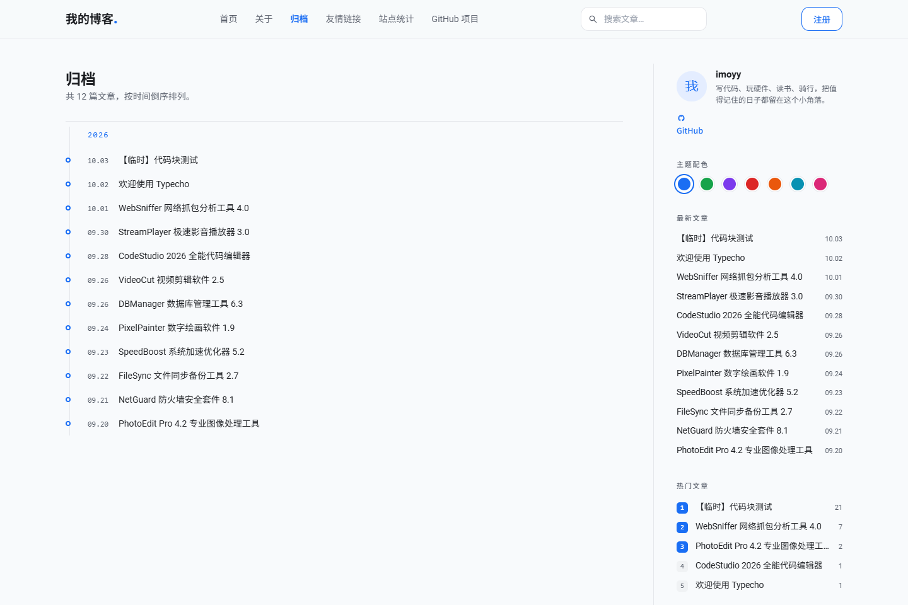
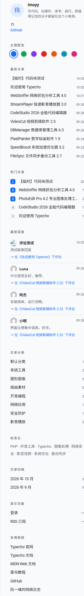

# INTP · Typecho 主题

极简双栏 Typecho 主题：侧边栏可左可右，Tailwind CSS + shadcn-ui 风格，IconPark 图标，代码高亮，时间轴归档。


## 特性

- **双栏布局**：侧边栏可置于左侧或右侧；十余种组件可自由开关、拖拽式排序（填写标识排序），支持自定义 HTML 组件
- **阅读量与点赞**：文章阅读量统计（同一访客 30 天内不重复计数）、文章点赞（同一访客仅可点赞一次），计数通过数据库原子 UPSERT 完成，并发不丢更新
- **文章置顶**：给文章添加自定义字段 `sticky` 即可在首页第一页顶部置顶
- **PJAX 无刷新跳转**：站内切换页面不刷新，自动重绑定交互脚本，阅读量正常累加
- **Service Worker 缓存**：缓存静态资源与最近访问页面，支持离线阅读，且不影响实时阅读量统计
- **列表排版与头图**：列表支持 big / small / full 三种排版（可用自定义字段 `list_layout` 逐篇覆盖）；支持自定义字段 `thumb` 指定头图、正文首图自动提取、随机头图池兜底
- **评论头像**：QQ 数字邮箱自动显示 QQ 头像，其余邮箱可在多种 Gravatar 兼容源间切换，支持自定义头像源
- **独立页面模板**：友情链接、GitHub 项目展示、站点统计（文章数 / 字数 / 评论数 / 分类标签等）
- **短代码**：评论可见隐藏内容、提示框、折叠面板、选项卡、进度条、按钮 / 徽章、分栏布局
- **代码高亮**、**时间轴归档**、**响应式移动端适配**
- **多数据库兼容**：支持 MySQL、PostgreSQL、SQLite

## 环境要求

- Typecho 1.2 及以上
- PHP 7.4+（推荐 PHP 8.0+）
- MySQL 5.7+ / PostgreSQL 10+ / SQLite 3.24+ 任一即可

## 安装

1. 下载本主题，将 `INTP` 文件夹放入 Typecho 的 `usr/themes/` 目录
2. 登录后台 → **控制台 → 外观**，找到「INTP」点击**启用**
3. 进入主题设置，按需要配置侧边栏、阅读量、点赞、PJAX、头像源等选项

## 常用自定义字段

| 字段 | 作用 | 取值 |
| --- | --- | --- |
| `sticky` | 首页置顶 | 任意非空值 |
| `thumb` | 指定文章头图 | 图片 URL |
| `list_layout` | 单独覆盖该文章在列表中的排版 | `big` / `small` / `full` |

## 页面模板

编辑独立页面时，可在「自定义模板」中选择：

- **友情链接**（`links.php`）：在主题设置中按 `站点名称 | 网址 | 简介` 每行一个填写
- **GitHub 项目**（`github.php`）：展示指定仓库或账号下最近更新的公开仓库
- **站点统计**（`stats.php`）：全站内容统计页

## 短代码

在文章或独立页面正文中直接书写短代码即可，主题会自动渲染为对应样式；代码块（`[code]` / `<pre>`）内的示例不会被解析，RSS 订阅中自动转为纯文本。短代码建议各自独占一行。

### 隐藏内容（评论可见）

```text
[hide]评论后才能看到的内容，如下载链接、提取码等[/hide]
```

- 访客在**本文**发表评论且评论**通过审核**后，刷新页面即可查看（评论成功时自动签发有效期 30 天的身份令牌，无需注册）
- 管理员与文章作者始终可见；未评论访客看到锁定提示
- 在**评论内容**中使用 `[hide]…[/hide]` 时为私密评论：仅该评论的发表者本人和管理员可见，其他人及 RSS 中只看到「私密评论」提示

### 其它短代码

| 短代码 | 写法示例 | 说明 |
| --- | --- | --- |
| 提示框 | `[alert type="info" title="提示"]内容[/alert]` | `type` 可选 `info` / `success` / `warning` / `danger`，`title` 可省略 |
| 折叠面板 | `[collapse title="点击展开 / 收起"]内容[/collapse]` | 加上裸标记 `open` 默认展开 |
| 进度条 | `[progress value="60" label="已完成 60%"][/progress]` | `value` 与 `percent` 等价（0–100）；省略 `label` 时显示百分比 |
| 选项卡 | `[tabs][tab title="标签一"]内容一[/tab][tab title="标签二"]内容二[/tab][/tabs]` | 至少一个 `[tab]`，首个标签默认激活 |
| 按钮 | `[button url="https://example.com" type="success"]立即下载[/button]` | `type` 可选 `success` / `warning` / `danger`；加 `target="_self"` 当前窗口打开，默认新窗口 |
| 徽章 | `[badge type="warning"]Beta[/badge]` | 加 `url="..."` 即渲染为链接徽章 |
| 分栏 | `[row][col width="50%"]左栏[/col][col width="50%"]右栏[/col][/row]` | `width` 可省略，窄屏自动堆叠为单列 |

## 截图

<details>
<summary>点击展开更多截图</summary>









</details>

## 技术栈

- 原生 Typecho 主题机制，无构建依赖
- Tailwind CSS（预编译样式）+ shadcn-ui 设计风格
- IconPark 图标
- PJAX + Service Worker

## 更新日志

### 1.0.1

- 修复 SQLite / PostgreSQL 下点赞与阅读量自增报 `Database Query Error` 的问题：原实现使用了 MySQL 专有的 `INSERT ... ON DUPLICATE KEY UPDATE` 语法
- 点赞 / 阅读量改为按数据库类型自动选择原子 UPSERT（MySQL `ON DUPLICATE KEY`、SQLite 与 PostgreSQL `ON CONFLICT ... DO UPDATE`）
- 修复热门文章、置顶文章查询在 PostgreSQL 下的标识符引号兼容问题
- 修复站点统计页总字数在 SQLite 下的字符长度函数兼容问题

### 1.0.0

- 首个正式版本

## 许可

本项目基于 [MIT License](LICENSE) 开源。

## 作者

[jianghuxiaosheng](https://github.com/jianghuxiaosheng)
